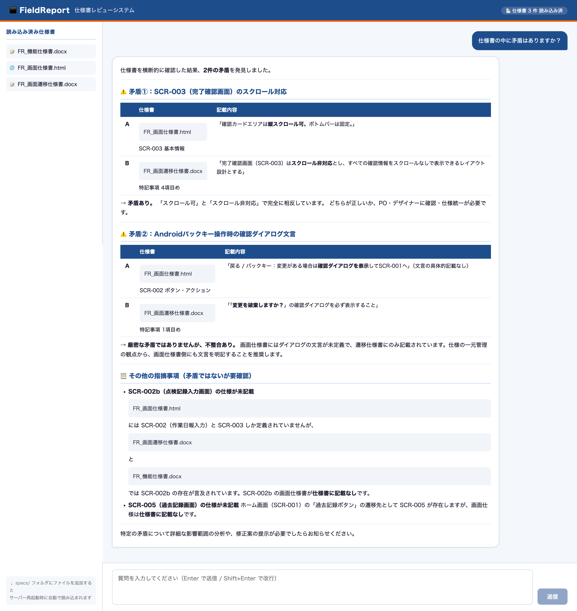

# FieldReport 仕様書レビューシステム

> 複数の仕様書を AI（Claude）でチャット形式にレビューする Web アプリケーション



---

## 概要

機能仕様書・画面仕様書・画面遷移仕様書をアップロードするだけで、以下の操作がチャット形式で可能になります。

- **矛盾チェック**：仕様書間の記述の食い違いを自動検出・優先度付きで報告
- **内容の質問応答**：「SCR-003 の仕様を教えて」などの自然言語での問い合わせ
- **不明点の指摘**：曖昧な定義・未定義の仕様箇所の洗い出し

### 実際の検出例（サンプル仕様書より）

| # | 箇所 | 種別 | 優先度 |
|---|------|------|--------|
| ① | SCR-003 スクロール可否 | 明確な矛盾 | 🔴 高 |
| ② | バックキー時ダイアログ文言 | 記載の不統一 | 🟡 中 |

---

## 技術スタック

| レイヤー | 技術 |
|---|---|
| フロントエンド | React 18 / TypeScript / Vite |
| バックエンド | Python 3.12 / FastAPI |
| AI | Claude API（Anthropic） |
| 仕様書パース | python-docx / BeautifulSoup4 |
| インフラ | Docker / docker-compose / nginx |

---

## 画面構成

```
┌─────────────────────────────────────────────┐
│  FieldReport  仕様書レビューシステム  📄 3件読み込み済 │
├────────────┬────────────────────────────────┤
│ 読み込み済み│                                │
│ 仕様書     │  👋 仕様書について質問してください  │
│            │                                │
│ 📝 機能仕様書│  ┌──────────────────────────┐ │
│ 🌐 画面仕様書│  │ サジェストボタン群         │ │
│ 📝 遷移仕様書│  └──────────────────────────┘ │
│            │                                │
│            │  ─── チャット履歴 ───           │
│            │                                │
│            ├────────────────────────────────┤
│            │  [ 質問を入力... ]     [ 送信 ] │
└────────────┴────────────────────────────────┘
```

---

## セットアップ

### 前提条件

- Anthropic API キー（[取得はこちら](https://console.anthropic.com/)）
- Docker & docker-compose（推奨）または Python 3.10+ / Node.js 18+

---

### 方法 A：Docker で起動（推奨）

```bash
git clone https://github.com/ska-miya/fieldreport-spec-review.git
cd fieldreport-spec-review

# 仕様書を配置
cp your-spec.docx specs/

# 環境変数を設定
cp .env.example backend/.env
# backend/.env を開いて ANTHROPIC_API_KEY を設定

# 起動（初回はビルドに数分かかります）
docker compose up --build
```

ブラウザで `http://localhost:5173` を開く。

---

### 方法 B：ローカルで起動

#### 1. リポジトリをクローン

```bash
git clone https://github.com/ska-miya/fieldreport-spec-review.git
cd fieldreport-spec-review
```

#### 2. 仕様書を配置

```bash
cp your-spec.docx specs/
```

#### 3. バックエンドをセットアップ

```bash
cd backend
python3 -m venv .venv
source .venv/bin/activate       # Windows: .venv\Scripts\activate
pip install -r requirements.txt

cp .env.example .env
# .env を開いて ANTHROPIC_API_KEY を設定

uvicorn main:app --reload
```

#### 4. フロントエンドをセットアップ（別ターミナル）

```bash
cd frontend
npm install
npm run dev
```

ブラウザで `http://localhost:5173`（または表示されたポート）を開く。

---

## フォルダ構成

```
fieldreport-spec-review/
├── specs/                        # 仕様書ファイル置き場（.docx / .html）
├── backend/
│   ├── main.py                   # FastAPI エンドポイント
│   ├── spec_loader.py            # 仕様書パース・Claude プロンプト生成
│   ├── requirements.txt
│   ├── Dockerfile
│   └── .env.example
├── frontend/
│   ├── src/
│   │   ├── types.ts              # 共通型定義（Message / SpecsResponse 等）
│   │   ├── App.tsx
│   │   └── components/
│   │       ├── ChatPanel.tsx     # チャット UI（Markdown レンダリング対応）
│   │       └── SpecList.tsx      # 仕様書ファイル一覧
│   ├── Dockerfile
│   ├── nginx.conf
│   ├── tsconfig.json
│   └── vite.config.ts
├── docker-compose.yml
└── docs/
    └── screenshot.png
```

---

## 使い方

1. バックエンド・フロントエンドを起動する
2. ブラウザで画面を開く
3. サジェストボタンをクリック、または自由に質問を入力する

**質問例：**
- `仕様書の中に矛盾はありますか？`
- `SCR-002 の必須入力項目を一覧で教えてください`
- `オフライン時の挙動はどの画面でどう定義されていますか？`

---

## ライセンス

MIT
